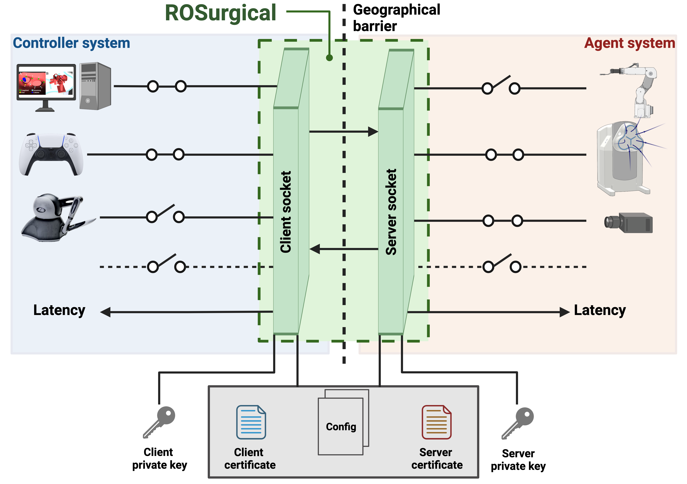

# rosurgical
---

`rosurgical` is a specialized ROS package designed to facilitate efficient and secure TCP/IP communication between two systems in a telesurgical setting. It provides a robust framework for exchanging ROS topics over a network, enabling seamless interaction between programs running on different systems.

## General Information
---
`rosurgical` runs two nodes - one on each side of the telesurgery setup. Each socket subscribes to the topics that are defined in a configuration file and originate on the respective host. When a topic is received, it is serialized and transmitted to the opposite host, where is is deserialized and published to the local ROS environment. 



`rosurgical` offers secure communication between the server and the client, by establishing an SSL/TLS connection. The hosts authenticate each other and then establish an encrypted connection. 

Additional, the `rosurgical` node on each host publishes the communication latency to its respective ROS environment.

> **INFO:** ROSurgical has initially been developed for a use case, which did not require the transmission of data-intesive streams (e.g. videos), and was successfully tested internationally for this use case. For use cases requiring video streams, ROSurgical's feasibility has only been tested over short distances. The full assessment of its feasiblity for data-intesinve tasks over long distances is still outstanding.  

## Installation
```rosurgical``` is compatible with ROS noetic. Make sure that ros noetic is installed and that you have a catkin workspace configured. After cloning ```rosurgical``` into the src directory of your workspace, the dependencies can be installed by running:
```bash
sudo rosdep update
rosdep install --from-paths <PATH_TO_ROSURGICAL> --ignore-src --rosdistro noetic
```
Subsequently, the package can be build by running:
```bash
catkin build rosurgical
```

## Node
---
### `rosurgical_node.py`
This node initializes a TCP/IP socket and establishes a connection with its counterpart, facilitating the exchange of ROS messages over a network in a secure and efficient manner. It is a central component of the `rosurgical` package, handling both data transmission and reception based on the specified role.

#### Parameters
- `~host` (string): The hostname or IP address of the server. For clients, this will be the server's address.
- `~port` (int): The port number for the TCP/IP connection.
- `~tcp_role` (string): Role of the socket. Can be either `server` or `client`.
- `~topic_yaml` (string): Path to the YAML file defining the topics for communication.
- `~wrap_ssl` (bool): Flag to enable secure SSL/TLS communication. Default: true.
- `~allow_self_signed` (bool): Flag to allow self-signed SSL certificates when `~wrap_ssl` is enabled. Default: true.
- `~cert_path` (string): Path to the SSL certificate file of the own host. Required if `~wrap_ssl` is true.
- `~key_path` (string): Path to the private key file of the own host. Required if `~wrap_ssl` is true.
- `~cert_verify_path` (string): Path to the SSL certificate file of the opposite host for verification. Required if `~wrap_ssl` is true.

#### Subscribed Topics
The node subscribes to the topics defined in the `~topic_yaml` file that originate on the own host, ensuring that local messages are properly transmitted to the remote host.

#### Published Topics
The node publishes the topics defined in the `~topic_yaml` file that originate from the opposite host, integrating remote messages into the local ROS environment. Additionally, it publishes two latency-related topics for monitoring communication performance:
- `communication_latency_float` ([std_msgs/Float32]): Communication latency in milliseconds.
- `communication_latency` ([jsk_rviz_plugins/OverlayText]): Visualization of communication latency in milliseconds for RViz.

#### Configuration File

The `rosurgical` package uses a YAML file to define the topics for communication. This file specifies the message types and origins (server or client) for each topic. Users can customize this file to include the topics relevant to their telesurgical setup.

Here is an example of a configuration file:

```yaml
float_server:
  msg_type: "std_msgs/Float32"
  origin: "server"
float_client:
  msg_type: "std_msgs/Float32"
  origin: "client"
string_client:
  msg_type: "std_msgs/String"
  origin: "client"
string_server:
  msg_type: "std_msgs/String"
  origin: "server"
```
In this example:
- ```float_server``` and ```string_server``` are topics that originate from the server.
- ```float_client``` and ```string_client``` are topics that originate from the client.
- Each topic is associated with a ROS message type (e.g., ```std_msgs/Float32```, ```std_msgs/String```).

Users should modify this file to reflect the specific topics and message types used in their telesurgical application.

## Launch files
- `start_server_localhost.launch`: Starts the server for testing `rosurgical` on a localhost. The test publishes a `std_msgs/Float32` and a `std_msgs/String` and registers them in the socket for transmission.
- `start_client_localhost.launch`: Starts the client for testing `rosurgical` on a localhost. The test publishes a `std_msgs/Float32` and a `std_msgs/String` and registers them in the socket for transmission.
- `start_server_internet.launch`: Starts the server for testing `rosurgical` in the network or public internet. The test publishes a `std_msgs/Float32` and a `std_msgs/String` and registers them in the socket for transmission. The HOSTNAME and PORT need to be configured accordingly. 
- `start_client_internet.launch`: Starts the client for testing `rosurgical` in the network or public internet. The test publishes a `std_msgs/Float32` and a `std_msgs/String` and registers them in the socket for transmission. The HOSTNAME and PORT need to be configured accordingly. 

## Quickstart Guide
---
### Localhost
To test `rosurgical` in a local environment (e.g., for development or testing purposes), you can run the package on a single machine by launching separate server and client nodes. This setup simulates the communication between two systems using the same host.

Before running the commands, ensure that `rosurgical` is properly installed on your system and the ROS environment is configured.
You need to launch the following command in two different terminals:
```bash
roslaunch rosurgical start_server_localhost.launch
```
```bash
roslaunch rosurgical start_client_localhost.launch
```

### Local Network
To run `rosurgical` between two systems connected within the same local network, you will need to launch the package on both the server and client systems. Ensure that both systems are configured to be on the same subnet for successful communication. Verify that both the server and client machines are connected to the same local network. Confirm that firewalls or network policies do not block the communication ports used by `rosurgical`.
On the server machine, run the following command. Make sure to adjust the `<HOSTNAME>` and `<PORT>` accordingly:
```bash
roslaunch rosurgical start_server_internet.launch
```
On the client machine, execute the following command. Make sure to adjust the `<HOSTNAME>` and `<PORT>` accordingly:
```bash
roslaunch rosurgical start_client_internet.launch
```

### Internet with Access to Router Settings
Typically, the server host is part of a local network behind a router and does not have a direct public IP address. In this case, you'll need to set up port forwarding on your router. This allows external connections from the internet to be directed to the server host within your local network.When running `rosurgical` over the internet and you have access to your router's settings, you'll need to set up port forwarding. This configuration allows external machines to connect to your `rosurgical` server through the internet by directing traffic from a specific port on your router to the server host within your local network. 

#### Steps for Configuration:

1. **Determine the Server's Local IP Address**: Identify the local IP address of the server machine within your network. This can typically be found in your system's network settings.

2. **Access Router Settings**: Log into your router's configuration page. 

3. **Set Up Port Forwarding**:
   - Navigate to the Port Forwarding section of your router's settings.
   - Create a new port forwarding entry. Enter the local IP address of your server and the port number used by `rosurgical`.
   - Specify the external port that will be used for accessing `rosurgical` over the internet.

4. **Use the Router's Public IP Address**: When setting up the client, use the router's public IP address as the `hostname` in the `rosurgical` configuration. This IP address can be found by searching "What is my IP" in a web browser, or through your router's settings page.

5. **Launch `rosurgical`**:
    - Launch `rosurgical` normally
    - On the client machine (over the internet), ensure it's configured to connect to the router's public IP and the port you've forwarded.

### Internet without Access to Router Settings (e.g., University or Hospital Network)

Running `rosurgical` on networks where you do not have access to router settings, like in a university or hospital, requires a different approach:

#### Obtaining a Public IP for the Server
- **Request a Public IP**: In environments like universities or hospitals, the IT department typically manages network configurations. You will need to request a public IP address for your server host from them.
- **DMZ Network**: Sometimes, institutions may place the server in a DMZ (Demilitarized Zone) network. This network segment is more accessible from the outside while being secured from the rest of the internal network.

#### Ensuring Open Ports
- **Request Open Ports**: Along with a public IP, ensure that the specific ports `rosurgical` uses for communication are open for incoming traffic. Provide the IT department with the necessary port numbers.
- **Firewall Settings**: Verify that any firewalls on your server host allow traffic on the `rosurgical` ports. This may require configuration changes or exceptions in the firewall settings.

#### Launching `rosurgical`
- Once a public IP is assigned and the necessary ports are open, you can launch `rosurgical` as you would normally:
   - On the server machine, use the public IP as the `hostname`.
   - On the client machine, connect to the server's public IP and the designated port.

### Ports <= 1024 (Privileged Ports)
Privileged ports are those with port numbers less than 1024. In many systems, only the root user has permission to bind to these ports. If `rosurgical` needs to use a privileged port, you can set up a port redirection from a higher, non-privileged port to the desired privileged port using `iptables`.

#### Setting Up Port Redirection
To redirect traffic from a privileged port to a higher port that `rosurgical` can use, you can use the `iptables` command. For example, to redirect traffic from port 443 (a common privileged port for HTTPS) to port 3000, use the following command:

```bash
sudo iptables -t nat -A PREROUTING -p tcp --dport 443 -j REDIRECT --to-ports 3000
```

## Generation of SSL Certificates and Private Keys
---
For secure SSL/TLS communication, `rosurgical` requires SSL certificates and private keys. Below are the steps to generate a certificate and a private key.

### Generating a Private Key

Run the following command to generate a private key:

```bash
openssl genrsa -out mykey.key 2048
```
This command creates a 2048-bit RSA private key and saves it to a file named mykey.key.

### Creating a Certificate Signing Request (CSR)

After generating the private key, create a CSR using the following command:
```bash
openssl req -new -key mykey.key -out mycsr.csr
```
During this process, you will be prompted to enter details such as your country, state, and organization. These details will be included in your CSR and are important for identifying the certificate owner. Choose a Certificate Authority (CA) and submit the CSR to the CA it.

### Generating a Self-Signed Certificate

If you need a self-signed certificate instead of submitting it to a CA, generate one using the following command:

```bash
openssl req -new -x509 -key mykey.key -out mycert.crt -days 365
```
This command creates a self-signed certificate, named mycert.crt, that is valid for 365 days.

### Verifying the Certificate (Optional)

To verify the contents of your generated certificate, especially to ensure that all entered details are correct, use:

```bash
openssl x509 -in mycert.crt -text -noout
```

This verification step allows you to view all the details included in the certificate.

## Citation
---
If you use `rosurgical` in your research or project, please cite the following paper:

```
@inproceedings{Heemeyer2024,
  doi = {TBD},
  url = {TBD},
  year = {2024},
  month = jun,
  publisher = {{IEEE}},
  author = {Florian Heemeyer and Quentin Boehler and Fabio Leuenberger and Bradley J. Nelson},
  title = {ROSurgical: An Open-Source Framework for Telesurgery},
  booktitle = {2024 International Symposium on Medical Robotics ({ISMR})}
}
```
